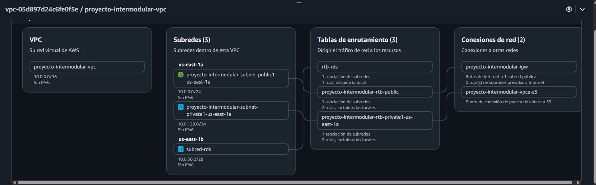
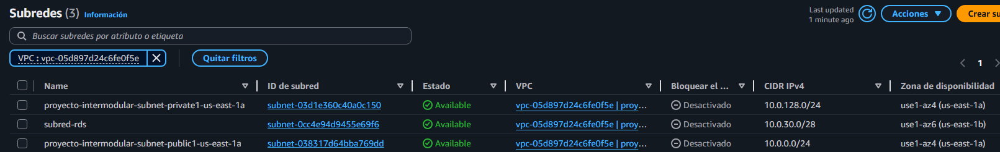
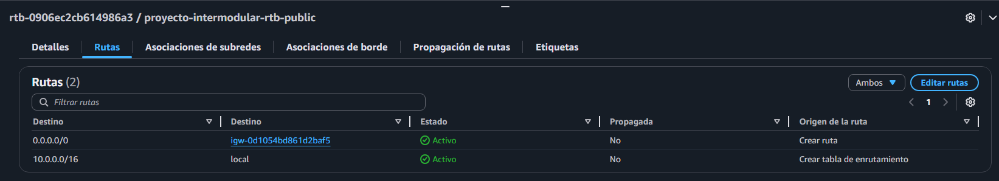
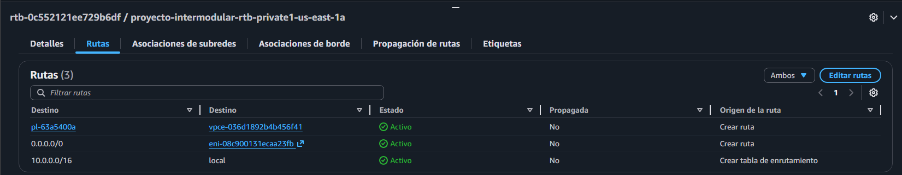
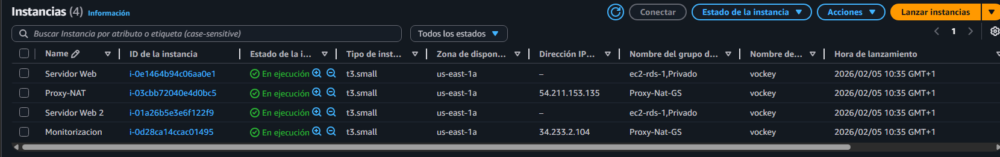
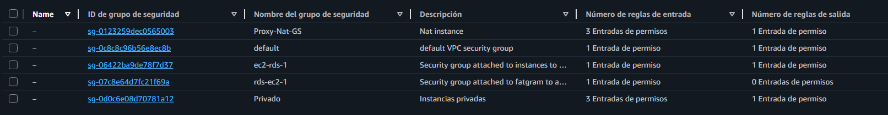
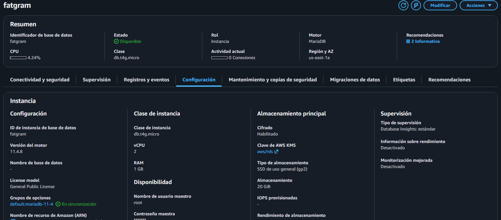
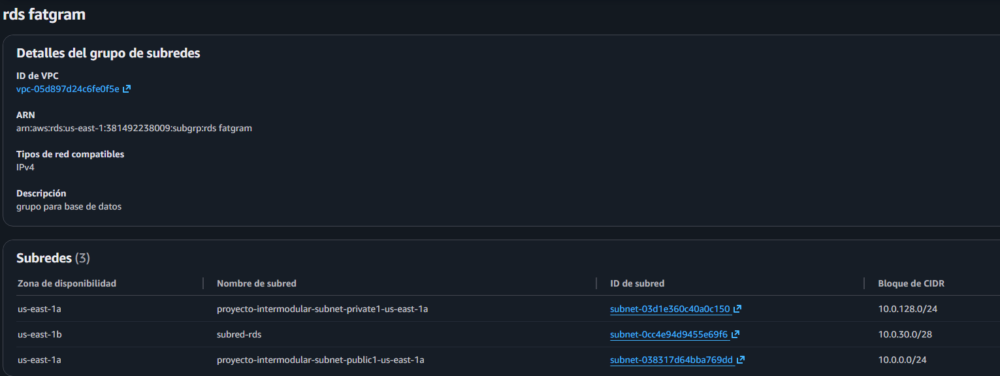

# FATGRAM
Este es el proyecto intermodular sobre una red social de comida que permite a los usuarios publicar sus recetas y que los restaurantes puedan publicitarse.

## Estructura de carpetas
- **FATGRAM/**
  - **[Servidor Web/](/Servidor%20Web/)**
    - Configuración de Nginx/
    - fatgram-theme/
    - style.css
    - README.md
  - **[Logs/](/Logs)**
    - monitor.csv
    - README.md
  - **[Scripts/](/Scripts/)**
    - Ansible/
    - Terraform/
    - Monitorización/
    - README.md
  - **[Documentos/](/Documentos)**
    - [CONSULTAS MARIADB SOBRE WORDPRESS FATGRAM.pdf](Documentos/Configuracion%20de%20la%20instancia%20NAT.pdf)
    - [Configuracion de la instancia NAT.pdf](Documentos/Configuracion%20de%20la%20instancia%20NAT.pdf)
    - [Plan De Transformación Digital – Fatgram.pdf](Documentos/Plan%20De%20Transformación%20Digital%20–%20Fatgram.pdf)
  - **[Imágenes/](/Imagenes/)**
  - README.md

## Infraestructura de AWS
En este apartado se muestra toda la infraestructura de nuestra nube de AWS para almacenar el proyecto
### Configuración de la VPC
Esta es la configuración de nuestra VPC de AWS

| Nombre | CIDR | Zona de disponibilidad | Región |
|:------:|:----:|:----------------------:|:------:|
| proyecto-intermodular-vpc | 10.0.0.0/16 | us-east1 | us-east1a, us-east1b (Región para la subred del RDS) |

### Configuración de la subredes
Esta tabla muestra la configuración de las subredes de nuestra VPC

| Subredes | CIDR | Zona de disponibilidad y región | Región |
|:--------:|:----:|:-------------------------------:|:------:|
| proyecto-intermodular-subnet-public1-us-east-1a | 10.0.0.0/24 | us-east-1 | us-east-1a |
| proyecto-intermodular-subnet-private1-us-east-1a | 10.0.128.0/24 | us-east-1 | us-east-1a |
| subred-rds | 10.0.30.0/24 | us-east-1 | us-east-1b |

**La subred del RDS forma parte de un grupo de subredes necesario para la creación de la base de datos, ya que requiere que se use otra región de soporte**

### Configuración de las tablas de enrutamiento
Estas imágenes muestran las tablas de enrutamiento de las subredes

#### Subred pública

#### Subred privada

### Configuración de las instancias 
Esta tabla muestra las instancias que usamos en AWS

| VPC | Instancia | Dirección IP | Subredes | Claves | Descripción | 
|:---:|:---------:|:------------:|:--------:|:------:|:-----------:|
| proyecto-intermodular-vpc | Proxy-NAT| 23.21.75.85 | proyecto-intermodular-subnet-public1-us-east-1a | vockey | Servidor Proxy encargado de recibir y redirigir el tráfico a los servidores web, que será accesible para todos|
| proyecto-intermodular-vpc | Servidor Web | No recibe IP pública | proyecto-intermodular-subnet-private1-us-east-1a | vockey | Servidor web que almacena Wordpress |
| proyecto-intermodular-vpc | Servidor Web 2 | No recibe IP pública | proyecto-intermodular-subnet-private1-us-east-1a | vockey | Servidor de balanceo de carga para el servidor web |
| proyecto-intermodular-vpc | Monitorización | 52.54.178.148 | proyecto-intermodular-subnet-public1-us-east-1a | vockey | Instancia utilizada que actúa como máquina local para monitorizar los servicios del proxy y el servidor web |

### Grupos de seguridad
Estos son los grupos de seguridad de las instancias y de la base de datos
| Grupos de seguridad | Descripción | Reglas de entrada | Regla de salida | Instancias asignadas |
|:-------------------:|:-----------:|:-----------------:|:---------------:|:--------------------:|
| Proxy-NAT-GS | Grupo de seguridad de la instancia NAT | 10.0.128.0/24, 0.0.0.0/0, 10.0.128.0/24:3306 | 0.0.0.0/0 (Todo el tráfico) | Proxy-NAT |
| ec2-rds-1 | Grupo de seguridad para el RDS-Instancia | 10.0.128.0/24:3306 | rds-ec2-1 (Grupo de seguridad) | FATGRAM RDS |
| rds-ec2-1 | Grupo de seguridad para Instancia-RDS | ec2-rds-1 | Sin regla de salida | FATGRAM RDS |
| Privado | Grupo de seguridad para las instancias privadas | 10.0.128.0/24:3306 | 0.0.0.0/0 | Servidor Web 1 y 2

### Configuración de la base de datos RDS
Esta es la configuración de la base de datos para almacenar los datos de nuestro sitio.

Para la creación de la base de datos, se ha tenido que crear un grupo de subredes que junta las subredes propias de la VPC y otra subred que pertenezca a otra región para que sirva de soporte en caso de que la primera región falle.

### Créditos
> Pablo Sainz de la Maza Rodríguez, Yeray Gutiérrez Mullor, Gabriel Calvo Aja
